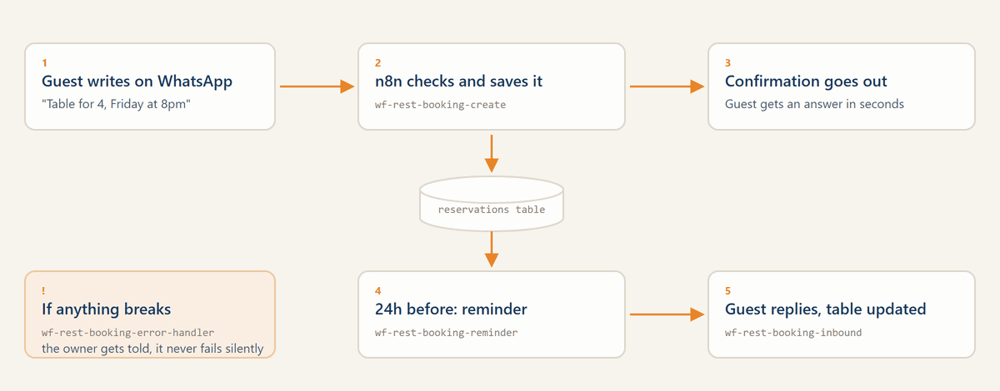

<p align="center">
  
</p>

<h1 align="center">n8n Local Business Automation Kit</h1>

<p align="center">
  Ready-to-import n8n workflows that let WhatsApp answer for a restaurant:<br>
  bookings, confirmations, reminders, and an error handler that never fails silently.
</p>

<p align="center">
  <a href="https://n8n.io"></a>
  <a href="LICENSE"></a>
  <a href="CONTRIBUTING.md"></a>
  <a href="https://radlab.it"></a>
</p>

<p align="center">
  <a href="#try-it-in-5-minutes">Quick start</a> |
  <a href="docs/guides/setup-restaurant-booking.md">Setup guide</a> |
  <a href="#available-now-restaurant-bookings">Workflows</a> |
  <a href="README.IT.md">Italiano 🇮🇹</a>
</p>

---

## How it works

<!-- TODO: Add GIF demo of a workflow in action -->

Each workflow solves a real business problem for local businesses:

1. **Customer writes on WhatsApp** (or books online)
2. **n8n processes the request** (creates booking, updates calendar, logs data)
3. **Automatic follow-up** (confirmation, reminder 24h before, review request after visit)

No coding required. Import the JSON, set up your credentials, and you're live.

---

## Try it in 5 minutes

1. Install [n8n](https://docs.n8n.io/hosting/) (cloud or self-hosted)
2. Download a workflow `.json` from the [`workflows/`](workflows/) folder
3. In n8n, go to **Workflows > Import from File** and upload it
4. Set up the required credentials (WhatsApp, Google Calendar, etc.)
5. Click **Execute Workflow** and test with sample data

> Want a ready-to-go demo instance? [Open an issue](../../issues/new) and we'll help you get started.

---

## Available now: restaurant bookings

Four workflows that work together as one booking system. Each one has its own page in [`docs/workflows/restaurants/`](docs/workflows/restaurants/).

| Workflow | File | What it does |
|----------|------|--------------|
| Create & Confirm | [`wf-rest-booking-create.v1.json`](workflows/restaurants/reservations/wf-rest-booking-create.v1.json) | Takes a booking request from a webhook, validates it, saves the reservation and sends the WhatsApp confirmation |
| Inbound Reply Handler | [`wf-rest-booking-inbound.v1.json`](workflows/restaurants/reservations/wf-rest-booking-inbound.v1.json) | Reads the guest's reply, marks the reservation confirmed or cancelled, flags anything it cannot parse for a human |
| Reminder 24h | [`wf-rest-booking-reminder.v1.json`](workflows/restaurants/reservations/wf-rest-booking-reminder.v1.json) | Runs every 15 minutes, sends the reminder to the bookings due tomorrow, marks them as reminded |
| Error Handler | [`wf-rest-booking-error-handler.v1.json`](workflows/restaurants/reservations/wf-rest-booking-error-handler.v1.json) | Catches failures from the other three, logs them and alerts the owner instead of failing silently |

**Typical results:** fewer missed calls, fewer no-shows.

---

## Roadmap

Not published yet. These run in production for clients and get released here once they are generic enough to be useful to someone else.

- **Restaurants:** no-show recovery, Google review request, weekly report
- **Hotels & B&Bs:** pre-stay welcome, booking reminder, post-stay review, win-back campaign
- **Salons & Beauty:** appointment reminder, no-show follow-up, rebooking nudge
- **Medical practices:** appointment reminder, annual check-up recall, post-visit feedback

Want one of these sooner? [Open an issue](../../issues/new) and say which one, it helps me pick the order.

---

## Repository structure

```
workflows/
  restaurants/
    reservations/    # the 4 booking workflows above
docs/
  workflows/
    restaurants/     # one .md per workflow
  guides/            # general guides (self-hosted setup, credentials)
demo/                # Docker Compose for local testing
.github/             # CI, issue templates, PR template
```

---

## Compatibility

- **n8n version:** >= 1.50.0 (tested up to latest)
- **Channels:** WhatsApp Business API, Telegram, Email, SMS
- **Integrations:** Google Calendar, Google Sheets, CRM webhooks
- **Hosting:** Works on n8n Cloud and self-hosted (Docker)

---

## For Italian businesses

These workflows were born from real automation projects for restaurants, hotels, salons and medical practices in **Campania, Italy** (Ischia, Procida, Naples).

All WhatsApp message templates are available in **Italian** inside the workflow JSON files. The documentation includes Italian guides in the [`docs/`](docs/) folder.

If you run a local business in Italy and want these workflows customized for you:

- **Setup** on n8n (cloud or your own server)
- **Integration** with your existing tools (PMS, booking systems, CRM)
- **Custom workflows** tailored to your specific needs

Get in touch: [RAD LAB](https://radlab.it) -- we automate local businesses so you can focus on your customers.

---

## Contributing

We welcome contributions! Whether it's a new workflow, a bug fix, or better documentation.

See [CONTRIBUTING.md](CONTRIBUTING.md) for guidelines.

---

## License

This project is licensed under the [Apache License 2.0](LICENSE).

You are free to use these workflows commercially, as long as you:
- Keep clear attribution to **RAD LAB** as the original author
- Don't resell them as-is as a closed proprietary product without substantial modifications

For commercial licensing questions: [riccardo@radlab.it](mailto:riccardo@radlab.it)

---

Made with dedication by [RAD LAB](https://radlab.it) -- Digital automation for local businesses.
